# 深入学习并发编程中的synchronized
<hr>

## 第一章：并发编程中的三个问题
<hr>

### 可见性
<hr>

#### 目标
学习什么是可见性问题

#### 可见性概念
可见性（Visibility）：是指一个线程对共享变量进行修改,另一个先立即得到修改后的最新值。

#### 可见性演示
案例演示：一个线程根据boolean类型的标记flag, while循环,另一个线程改变这个flag变量的值,另
一个线程并不会停止循环。
```java
package com.huajframe.demo01_concurrent_problem;

/**
 * 可见性（Visibility）：是指一个线程对共享变量进行修改,另一个线程立即得到修改后的最新值
 * 可见性演示
 *      一个线程对共享变量的修改,另一个线程不能立即得到最新值
 */
public class Test01Visibility {
    private static boolean run = true;

    public static void main(String[] args) throws InterruptedException {
        //线程2修改后线程1并没有结束,程序一直在运行
        Thread t1 = new Thread(() -> {
            while (run){

            }
        });

        t1.start();

        Thread.sleep(1000);

        Thread t2 = new Thread(() -> {
            run = false;
            System.out.println("时间到,线程2设置为false");
        });
        t2.start();
    }
}
```

#### 小结
并发编程时,会出现可见性问题,当一个线程对共享变量进行了修改,另外的线程并没有立即看到修改
后的最新值。

### 原子性
<hr>

#### 目标
学习什么是原子性问题

#### 原子性概念
原子性（Atomicity）：在一次或多次操作中,要么所有的操作都执行并且不会受其他因素干扰而中
断,要么所有的操作都不执行。

#### 原子性演示
案例演示:5个线程各执行1000次 i++;
```java
package com.huajframe.demo01_concurrent_problem;

import java.util.ArrayList;
import java.util.List;

/**
 * 原子性（Atomicity）：在一次或多次操作中,要么所有的操作都执行并且不会受其他因素干扰而中
 * 断,要么所有的操作都不执行。
 */
public class Test02Atomicity {
    private static int number = 0;

    public static void main(String[] args) throws InterruptedException {
        Runnable increment = () -> {
            for (int i = 0; i < 1000; i++) {
                number++;
            }
        };

        List<Thread> list = new ArrayList<>();
        for (int i = 0; i < 5; i++) {
            Thread t = new Thread(increment);
            t.start();
            list.add(t);
        }

        for(Thread t : list){
            t.join();
        }

        System.out.println("number = " + number);
    }
}
```
使用javap反汇编class文件,得到下面的字节码指令：
<center>

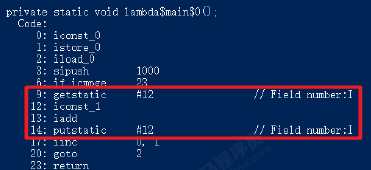
</center>
其中,对于 number++ 而言（number 为静态变量）,实际会产生如下的 JVM 字节码指令：

```text
9: getstatic #12          // Field number:I
12: iconst_1
13: iadd
14: putstatic #12         // Field number:I
```
由此可见number++是由多条语句组成,以上多条指令在一个线程的情况下是不会出问题的,但是在多
线程情况下就可能会出现问题。比如一个线程在执行13: iadd时,另一个线程又执行9: getstatic。会导
致两次number++,实际上只加了1。

#### 小结
并发编程时,会出现原子性问题,当一个线程对共享变量操作到一半时,另外的线程也有可能来操作共
享变量,干扰了前一个线程的操作。


### 有序性
<hr>

#### 目标
学习什么是有序性问题

#### 有序性概念
有序性（Ordering）：是指程序中代码的执行顺序,Java在编译时和运行时会对代码进行优化,会导致
程序最终的执行顺序不一定就是我们编写代码时的顺序
```java
public static void main(String[] args) {
    int a = 10;
    int b = 20;
}
```

#### 有序性演示
jcstress是java并发压测工具。https://wiki.openjdk.java.net/display/CodeTools/jcstress
修改pom文件,添加依赖(后续依赖及插件一起加上)：
```xml
<properties>
    <maven.compiler.source>8</maven.compiler.source>
    <maven.compiler.target>8</maven.compiler.target>
    <javac.target>1.8</javac.target>
    <jcstress.version>0.5</jcstress.version>
    <uberjar.name>jcstress</uberjar.name>
</properties>

<dependencies>
    <dependency>
        <groupId>org.openjdk.jcstress</groupId>
        <artifactId>jcstress-core</artifactId>
        <version>${jcstress.version}</version>
    
    </dependency>
    <dependency>
        <groupId>org.openjdk.jol</groupId>
        <artifactId>jol-core</artifactId>
        <version>0.9</version>
    </dependency>
    <dependency>
        <groupId>junit</groupId>
        <artifactId>junit</artifactId>
        <version>4.12</version>
        <scope>compile</scope>
    </dependency>
    <dependency>
        <groupId>junit</groupId>
        <artifactId>junit</artifactId>
        <version>4.12</version>
        <scope>compile</scope>
    </dependency>
</dependencies>

<build>
    <plugins>
        <plugin>
            <groupId>org.apache.maven.plugins</groupId>
            <artifactId>maven-compiler-plugin</artifactId>
            <version>3.1</version>
            <configuration>
                <compilerVersion>${javac.target}</compilerVersion>
                <source>${javac.target}</source>
                <target>${javac.target}</target>
            </configuration>
        </plugin>
    
        <plugin>
            <groupId>org.apache.maven.plugins</groupId>
            <artifactId>maven-shade-plugin</artifactId>
            <version>2.2</version>
            <executions>
                <execution>
                    <id>main</id>
                    <phase>package</phase>
                    <goals>
                        <goal>shade</goal>
                    </goals>
                    <configuration>
                        <finalName>${uberjar.name}</finalName>
                        <transformers>
                            <transformer
                                    implementation="org.apache.maven.plugins.shade.resource.ManifestResourceTransformer">
                                <mainClass>org.openjdk.jcstress.Main</mainClass>
                            </transformer>
                            <transformer implementation="org.apache.maven.plugins.shade.resource.AppendingTransformer">
                                <resource>META-INF/TestList</resource>
                            </transformer>
                        </transformers>
                    </configuration>
                </execution>
            </executions>
        </plugin>
    </plugins>
</build>
```

代码：
Test03Orderliness.java
```java
package com.huajframe.demo01_concurrent_problem;

import org.openjdk.jcstress.annotations.*;
import org.openjdk.jcstress.infra.results.I_Result;

/**
 * 有序性
 * 是指程序中代码的执行顺序,Java在编译时和运行时会对代码进行优化,会导致
 * 程序最终的执行顺序不一定就是我们编写代码时的顺序。
 *
 * 出现0的结果就是线程2执行顺序出现问题
 */
@JCStressTest
@Outcome(id = {"1", "4"}, expect = Expect.ACCEPTABLE, desc = "ok")
@Outcome(id = "0", expect = Expect.ACCEPTABLE_INTERESTING, desc = "danger")
@State
public class Test03Orderliness {
    int num = 0;
    boolean ready = false;

    //线程1
    @Actor
    public void actor1(I_Result r){
        if(ready){
            r.r1 = num + num;
        }else{
            r.r1 = 1;
        }
    }

    //线程2
    @Actor
    public void actor2(I_Result r){
        num = 2;
        ready = true;
    }
}

```

- I_Result 是一个对象,有一个属性r1 用来保存结果,在多线程情况下可能出现几种结果？ 情况1：线
程1先执行actor1,这时ready = false,所以进入else分支结果为1。
- 情况2：线程2执行到actor2,执行了num = 2;和ready = true,线程1执行,这回进入 if 分支,结果为
4。
- 情况3：线程2先执行actor2,只执行num = 2；但没来得及执行 ready = true,线程1执行,还是进入
else分支,结果为1。
- <font color="red">还有一种结果0</font>

运行测试：
```text
mvn clean install
java -jar target/jcstress.jar
```

#### 小结
程序代码在执行过程中的先后顺序,由于Java在编译期以及运行期的优化,导致了代码的执行顺序未必
就是开发者编写代码时的顺序。


## 第二章：Java内存模型(JMM)
<hr>

在介绍Java内存模型之前,先来看一下到底什么是计算机内存模型。

### 计算机结构
<hr>

#### 目标
学习计算机的主要组成

学习缓存的作用

#### 计算机结构简介
冯诺依曼,提出计算机由五大组成部分,输入设备,输出设备存储器,控制器,运算器。
<center>

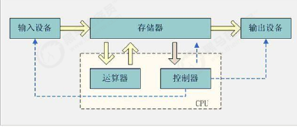
</center>

##### CPU
中央处理器,是计算机的控制和运算的核心,我们的程序最终都会变成指令让CPU去执行,处理程序中
的数据。
<center>


</center>

##### 内存
我们的程序都是在内存中运行的,内存会保存程序运行时的数据,供CPU处理。
<center>


</center>

##### 缓存
CPU的运算速度和内存的访问速度相差比较大。这就导致CPU每次操作内存都要耗费很多等待时间。内
存的读写速度成为了计算机运行的瓶颈。于是就有了在CPU和主内存之间增加缓存的设计。最靠近CPU
的缓存称为L1,然后依次是 L2,L3和主内存,CPU缓存模型如图下图所示。
<center>

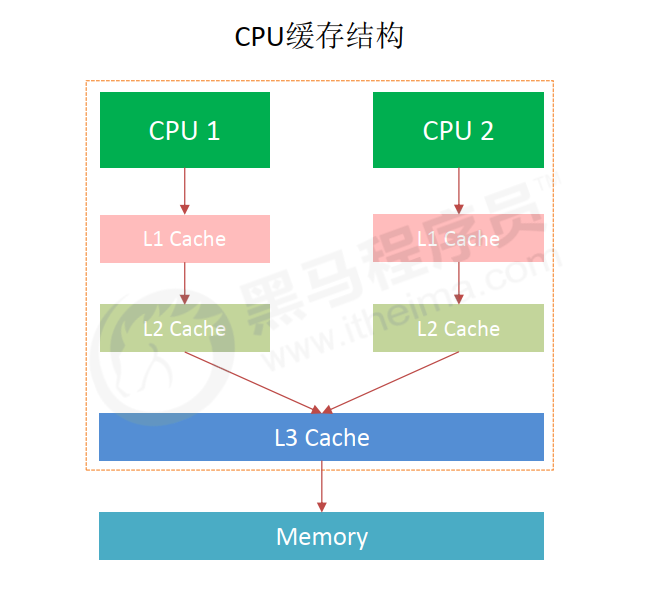
</center>

CPU Cache分成了三个级别: L1, L2, L3。级别越小越接近CPU,速度也更快,同时也代表着容量越
小。

1. L1是最接近CPU的,它容量最小,例如32K,速度最快,每个核上都有一个L1 Cache。
2. L2 Cache 更大一些,例如256K,速度要慢一些,一般情况下每个核上都有一个独立的L2 Cache。
3. L3 Cache是三级缓存中最大的一级,例如12MB,同时也是缓存中最慢的一级,在同一个CPU插槽
   之间的核共享一个L3 Cache。

<center>


</center>
Cache的出现是为了解决CPU直接访问内存效率低下问题的,程序在运行的过程中,CPU接收到指令
后,它会最先向CPU中的一级缓存（L1 Cache）去寻找相关的数据,如果命中缓存,CPU进行计算时就
可以直接对CPU Cache中的数据进行读取和写人,当运算结束之后,再将CPUCache中的最新数据刷新
到主内存当中,CPU通过直接访问Cache的方式替代直接访问主存的方式极大地提高了CPU 的吞吐能
力。但是由于一级缓存（L1 Cache）容量较小,所以不可能每次都命中。这时CPU会继续向下一级的二
级缓存（L2 Cache）寻找,同样的道理,当所需要的数据在二级缓存中也没有的话,会继续转向L3
Cache、内存(主存)和硬盘。

#### 小结
计算机的主要组成CPU,内存,输入设备,输出设备。

### Java内存模型
<hr>

#### 目标
学习Java内存模型的概念和作用

#### Java内存模型的概念
Java Memory Molde (Java内存模型/JMM),千万不要和Java内存结构混淆

关于“Java内存模型”的权威解释,请参考 https://download.oracle.com/otn-pub/jcp/memory_model-
1.0-pfd-spec-oth-JSpec/memory_model-1_0-pfd-spec.pdf。

Java内存模型,是Java虚拟机规范中所定义的一种内存模型,Java内存模型是标准化的,屏蔽掉了底层
不同计算机的区别。

Java内存模型是一套规范,描述了Java程序中各种变量(线程共享变量)的访问规则,以及在JVM中将变量
存储到内存和从内存中读取变量这样的底层细节,具体如下。

- 主内存
  
   主内存是所有线程都共享的,都能访问的。所有的共享变量都存储于主内存。
- 工作内存

  每一个线程有自己的工作内存,工作内存只存储该线程对共享变量的副本。线程对变量的所有的操
  作(读,取)都必须在工作内存中完成,而不能直接读写主内存中的变量,不同线程之间也不能直接
  访问对方工作内存中的变量

<center>


</center>

#### Java内存模型的作用
Java内存模型是一套在多线程读写共享数据时,对共享数据的可见性、有序性、和原子性的规则和保
障。

`synchronized`,`volatile`

#### CPU缓存,内存与Java内存模型的关系
通过对前面的CPU硬件内存架构、Java内存模型以及Java多线程的实现原理的了解,我们应该已经意识
到,多线程的执行最终都会映射到硬件处理器上进行执行。

但Java内存模型和硬件内存架构并不完全一致。对于硬件内存来说只有寄存器、缓存内存、主内存的概
念,并没有工作内存和主内存之分,也就是说Java内存模型对内存的划分对硬件内存并没有任何影响,
因为JMM只是一种抽象的概念,是一组规则,不管是工作内存的数据还是主内存的数据,对于计算机硬
件来说都会存储在计算机主内存中,当然也有可能存储到CPU缓存或者寄存器中,因此总体上来说,
Java内存模型和计算机硬件内存架构是一个相互交叉的关系,是一种抽象概念划分与真实物理硬件的交
叉。

<font color="red">JMM内存模型与CPU硬件内存架构的关系：</font>
<center>

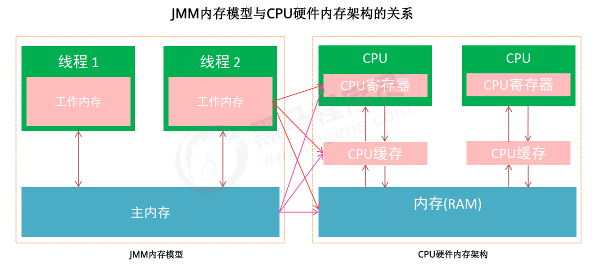
</center>

#### 小结
Java内存模型是一套规范,描述了Java程序中各种变量(线程共享变量)的访问规则,以及在JVM中将变量
存储到内存和从内存中读取变量这样的底层细节,Java内存模型是对共享数据的可见性、有序性、和原
子性的规则和保障。

### 主内存与工作内存之间的交互
<hr>

<center>

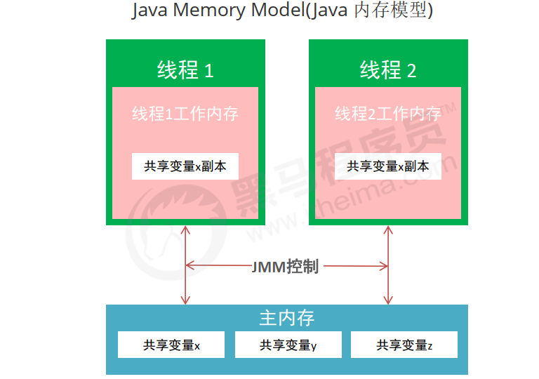
</center>

#### 目标
了解主内存与工作内存之间的数据交互过程

Java内存模型中定义了以下8种操作来完成,主内存与工作内存之间具体的交互协议,即一个变量如何
从主内存拷贝到工作内存、如何从工作内存同步回主内存之类的实现细节,虚拟机实现时必须保证下面
提及的每一种操作都是原子的、不可再分的。

对应如下的流程图：
<center>


</center>

注意：

1. 如果对一个变量执行lock操作,将会清空工作内存中此变量的值
2. 对一个变量执行unlock操作之前,必须先把此变量同步到主内存中

#### 小结
主内存与工作内存之间的数据交互过程

```text
lock -> read -> load -> use -> assign -> store -> write -> unlock
```


## 第三章：synchronized保证三大特性
<hr>
synchronized能够保证在同一时刻最多只有一个线程执行该段代码,以达到保证并发安全的效果。

```java
synchronized (锁对象) {
    // 受保护资源;
}
```
### synchronized与原子性
<hr>

#### 目标
学习使用synchronized保证原子性的原理

#### 使用synchronized保证原子性
案例演示:5个线程各执行1000次 i++;

```java
package com.huajframe.demo02_concurrent_problem;

import java.util.ArrayList;
import java.util.List;

/**
 * synchronized保证原子性操作
 *
 * 原子性（Atomicity）：在一次或多次操作中,要么所有的操作都执行并且不会受其他因素干扰而中
 * 断,要么所有的操作都不执行。
 */
public class Test02Atomicity {
    private static int number = 0;
    private static Object obj = new Object();

    public static void main(String[] args) throws InterruptedException {
        Runnable increment = () -> {
            for (int i = 0; i < 1000; i++) {
                synchronized (obj){
                    number++;
                }
            }
        };

        List<Thread> list = new ArrayList<>();
        for (int i = 0; i < 5; i++) {
            Thread t = new Thread(increment);
            t.start();
            list.add(t);
        }

        for(Thread t : list){
            t.join();
        }

        System.out.println("number = " + number);
    }
}
```

```java
for (int i = 0; i < 1000; i++) {
    synchronized (obj){
        number++;
    }
}
```

#### synchronized保证原子性的原理
对number++;增加同步代码块后,保证同一时间只有一个线程操作number++;。就不会出现安全问题。

#### 小结
synchronized保证原子性的原理,synchronized保证只有一个线程拿到锁,能够进入同步代码块。


### synchronized与可见性
<hr>

#### 目标
学习使用synchronized保证可见性的原理

#### 使用synchronized保证可见性
案例演示：一个线程根据boolean类型的标记flag, while循环,另一个线程改变这个flag变量的值,另
一个线程并不会停止循环。

```java
package com.huajframe.demo02_concurrent_problem;

/**
 * synchronized保证可见性操作
 *
 * 可见性（Visibility）：是指一个线程对共享变量进行修改,另一个线程立即得到修改后的最新值
 * 可见性演示
 *      一个线程对共享变量的修改,另一个线程不能立即得到最新值
 */
public class Test01Visibility {
    /**
     * 当写一个volatile变量时,JMM会把该线程本地内存中的变量强制刷新到主内存中去；
     *     这个写会操作会导致其他线程中的volatile变量缓存无效
     */
    // private static volatile boolean run = true;

    private static boolean run = true;

    public static void main(String[] args) throws InterruptedException {
        //线程2修改后线程1并没有结束,程序一直在运行
        Thread t1 = new Thread(() -> {
            while (run){
                synchronized (Test01Visibility.class){

                }
                // System.out.println(run);
            }
        });

        t1.start();

        Thread.sleep(1000);

        Thread t2 = new Thread(() -> {
            run = false;
            System.out.println("时间到,线程2设置为false");
        });
        t2.start();
    }
}
```

#### synchronized保证可见性的原理
<center>


</center>

#### 小结
synchronized保证可见性的原理,执行synchronized时,会对应lock原子操作会刷新工作内存中共享变
量的值


### synchronized与有序性
<hr>

#### 目标
学习使用synchronized保证有序性的原理

#### 为什么要重排序
为了提高程序的执行效率,编译器和CPU会对程序中代码进行重排序。

##### as-if-serial语义
as-if-serial语义的意思是：不管编译器和CPU如何重排序,必须保证在单线程情况下程序的结果是正确
的。

以下数据有依赖关系,不能重排序。

写后读：
```java
int a = 1;
int b = a;
```

写后写：
```java
int a = 1;
int a = 2;
```

读后写：
```java
int a = 1;
        int b = a;
        int a = 2;
```

编译器和处理器不会对存在数据依赖关系的操作做重排序,因为这种重排序会改变执行结果。但是,如
果操作之间不存在数据依赖关系,这些操作就可能被编译器和处理器重排序。
```java
int a = 1;
int b = 2;
int c = a + b;
```

如上所示a和c之间存在数据依赖关系,同时b和c之间也存在数据依赖关系。因此在最终执行的指令序
列中,c不能被重排序到a和b的前面。但a和b之间没有数据依赖关系,编译器和处理器可以重排序a和b
之间的执行顺序。下面是该程序的两种执行顺序。
```java
//可以这样：
int a = 1;
int b = 2;
int c = a + b;

//也可以重排序这样：
int b = 2;
int a = 1;
int c = a + b;
```

#### 使用synchronized保证有序性
Test03Orderliness.java
```java
package com.huajframe.demo02_concurrent_problem;

import org.openjdk.jcstress.annotations.*;
import org.openjdk.jcstress.infra.results.I_Result;

/**
 * synchronized保证有序性操作
 *
 * 有序性
 * 是指程序中代码的执行顺序,Java在编译时和运行时会对代码进行优化,会导致
 * 程序最终的执行顺序不一定就是我们编写代码时的顺序。
 *
 * 出现0的结果就是线程2执行顺序出现问题
 */
@JCStressTest
@Outcome(id = {"1"}, expect = Expect.ACCEPTABLE, desc = "ok1")
@Outcome(id = {"4"}, expect = Expect.ACCEPTABLE_INTERESTING, desc = "danger1")
@Outcome(id = "0", expect = Expect.ACCEPTABLE_INTERESTING, desc = "danger2")
@State
public class Test03Orderliness {
    int num = 0;
    boolean ready = false;
    private Object obj = new Object();

    //线程1
    @Actor
    public void actor1(I_Result r){
        synchronized (obj){
            if(ready){
                r.r1 = num + num;
            }else{
                r.r1 = 1;
            }
        }
    }

    //线程2
    @Actor
    public void actor2(I_Result r){
        synchronized (obj){
            num = 2;
            ready = true;
        }
    }
}
```

#### synchronized保证有序性的原理
synchronized后,虽然进行了重排序,保证只有一个线程会进入同步代码块,也能保证有序性。

#### 小结
synchronized保证有序性的原理,我们加synchronized后,依然会发生重排序,只不过,我们有同步
代码块,可以保证只有一个线程执行同步代码中的代码。保证有序性


## 第四章：synchronized的特性
<hr>

### 可重入特性
<hr>

#### 目标
了解什么是可重入

了解可重入的原理

#### 什么是可重入
一个线程可以多次执行synchronized,重复获取同一把锁。

```java
package com.huajframe.demo03_concurrent_problem;

public class Demo01 {

    public static void main(String[] args) {
        new MyThread().start();
        new MyThread().start();
    }

    public static void test01(){
        synchronized (MyThread.class){
            String name = Thread.currentThread().getName();
            System.out.println(name + "进入了同步代码快2");
        }
    }
}

class MyThread extends Thread{

    @Override
    public void run() {
        synchronized (MyThread.class){
            System.out.println(getName() + "进入了同步代码快1");

            // synchronized (MyThread.class){
            //     System.out.println(getName() + "进入了同步代码快2");
            // }
            Demo01.test01();
        }
    }
}
```

#### 可重入原理
synchronized的锁对象中有一个计数器（recursions变量）会记录线程获得几次锁.

#### 可重入的好处
1. 可以避免死锁
2. 可以让我们更好的来封装代码

#### 小结
synchronized是可重入锁,内部锁对象中会有一个计数器记录线程获取几次锁啦,在执行完同步代码块
时,计数器的数量会-1,知道计数器的数量为0,就释放这个锁。

### 不可中断特性
<hr>

#### 目标
学习synchronized不可中断特性

学习Lock的可中断特性
#### 什么是不可中断
一个线程获得锁后,另一个线程想要获得锁,必须处于阻塞或等待状态,如果第一个线程不释放锁,第
二个线程会一直阻塞或等待,不可被中断。

#### synchronized不可中断演示
synchronized是不可中断,处于阻塞状态的线程会一直等待锁。
```java
package com.huajframe.demo03_concurrent_problem;

/**
 * 目标:演示synchronized不可中断
 *      1.定义一个Runnable
 *      2.在Runnable定义同步代码块
 *      3.先开启一个线程来执行同步代码块,保证不退出同步代码块
 *      4.后开启一个线程来执行同步代码块(阻塞状态)
 *      5.停止第二个线程
 */
public class Demo02_Uninterruptible {
    private static Object obj = new Object();
    public static void main(String[] args) throws InterruptedException {
        // 1.定义一个Runnable
        Runnable run = () -> {
            // 2.在Runnable定义同步代码块
            synchronized (obj){
                String name = Thread.currentThread().getName();
                System.out.println(name + "进入同步代码块");
                try {
                    Thread.sleep(8888888);
                } catch (InterruptedException e) {
                    e.printStackTrace();
                }
            }
        };

        // 3.先开启一个线程来执行同步代码块,保证不退出同步代码块
        Thread t1 = new Thread(run);
        t1.start();
        Thread.sleep(1000);
        // 4.后开启一个线程来执行同步代码块(阻塞状态)
        Thread t2 = new Thread(run);
        t2.start();
        // 5.停止第二个线程
        System.out.println("停止线程前");
        t2.interrupt();
        System.out.println("停止线程后");

        System.out.println(t1.getState());
        System.out.println(t2.getState());
    }
}
```

#### ReentrantLock可中断演示
```java
package com.huajframe.demo03_concurrent_problem;

import java.util.concurrent.TimeUnit;
import java.util.concurrent.locks.Lock;
import java.util.concurrent.locks.ReentrantLock;

/**
 * ReentrantLock可中断演示
 */
public class Demo03_Interruptible {
    private static Lock lock = new ReentrantLock();
    public static void main(String[] args) throws InterruptedException {
        test02();
    }

    // 演示Lock不可中断
    private static void test01() throws InterruptedException {
        Runnable run = () -> {
            String name = Thread.currentThread().getName();
            try {
                lock.lock();
                System.out.println(name + "获得锁,进入锁执行");
                Thread.sleep(88888);
            } catch (InterruptedException e) {
                e.printStackTrace();
            }finally {
                lock.unlock();
                System.out.println(name + "释放锁");
            }
        };

        Thread t1 = new Thread(run);
        t1.start();
        Thread.sleep(1000);
        Thread t2 = new Thread(run);
        t2.start();

        System.out.println("停止t2线程前");
        t2.interrupt();
        System.out.println("停止t2线程后");

        Thread.sleep(1000);
        System.out.println(t1.getState());
        System.out.println(t2.getState());
    }

    //演示Lock可中断
    private static void test02() throws InterruptedException {
        Runnable run = () -> {
            String name = Thread.currentThread().getName();
            boolean b = false;
            try {
                b = lock.tryLock(3, TimeUnit.SECONDS);
                if(b) {
                    System.out.println(name + "获得锁,进入锁执行");
                    Thread.sleep(88888);
                }else{
                    System.out.println(name + "在指定时间没有得到锁做其他操作");
                }
            } catch (InterruptedException e) {
                e.printStackTrace();
            }finally {
                if(b){
                    lock.unlock();
                    System.out.println(name + "释放锁");
                }
            }
        };

        Thread t1 = new Thread(run);
        t1.start();
        Thread.sleep(1000);
        Thread t2 = new Thread(run);
        t2.start();

        // System.out.println("停止t2线程前");
        // t2.interrupt();
        // System.out.println("停止t2线程后");
        //
        //
        Thread.sleep(5000);
        System.out.println(t1.getState());
        System.out.println(t2.getState());
    }
}
```

#### 小结
不可中断是指,当一个线程获得锁后,另一个线程一直处于阻塞或等待状态,前一个线程不释放锁,后
一个线程会一直阻塞或等待,不可被中断。

synchronized属于不可被中断

Lock的lock方法是不可中断的

Lock的tryLock方法是可中断的


## 第五章：synchronized原理
<hr>

### javap 反汇编
<hr>

#### 目标
通过javap反汇编学习synchronized的原理

我们编写一个简单的synchronized代码,如下：
```java
package com.huajframe.demo04_concurrent_problem;

public class Demo01 {
    private static Object obj = new Object();
    public static void main(String[] args) {
        synchronized (obj) {
            System.out.println("1");
        }
    }

    public synchronized void test() {
        System.out.println("a");
    }
}
```

我们要看synchronized的原理,但是synchronized是一个关键字,看不到源码。我们可以将class文件
进行反汇编。

JDK自带的一个工具： javap ,对字节码进行反汇编,查看字节码指令。

在DOS命令行输入：
```text
javap -p -v -c .\target\classes\com\huajframe\demo04_concurrent_problem\Demo01.class
```

反汇编后的效果如下：
```text
public static void main(java.lang.String[]);
    descriptor: ([Ljava/lang/String;)V
    flags: ACC_PUBLIC, ACC_STATIC
    Code:
      stack=2, locals=3, args_size=1
         0: getstatic     #2                  // Field obj:Ljava/lang/Object;
         3: dup
         4: astore_1
         5: monitorenter
         6: getstatic     #3                  // Field java/lang/System.out:Ljava/io/Print
Stream;
         9: ldc           #4                  // String 1
        11: invokevirtual #5                  // Method java/io/PrintStream.println:(Ljava
/lang/String;)V
        14: aload_1
        15: monitorexit
        16: goto          24
        19: astore_2
        20: aload_1
        21: monitorexit
        22: aload_2
        23: athrow
        24: return
      Exception table:
         from    to  target type
             6    16    19   any
            19    22    19   any
      LineNumberTable:
        line 6: 0
        line 7: 6
        line 8: 14
        line 9: 24
      LocalVariableTable:
        Start  Length  Slot  Name   Signature
            0      25     0  args   [Ljava/lang/String;
      StackMapTable: number_of_entries = 2
        frame_type = 255 /* full_frame */
          offset_delta = 19
          locals = [ class "[Ljava/lang/String;", class java/lang/Object ]
          stack = [ class java/lang/Throwable ]
        frame_type = 250 /* chop */
          offset_delta = 4

  public synchronized void test();
    descriptor: ()V
    flags: ACC_PUBLIC, ACC_SYNCHRONIZED
    Code:
      stack=2, locals=1, args_size=1
         0: getstatic     #3                  // Field java/lang/System.out:Ljava/io/Print
Stream;
         3: ldc           #6                  // String a
         5: invokevirtual #5                  // Method java/io/PrintStream.println:(Ljava
/lang/String;)V
         8: return
      LineNumberTable:
        line 12: 0
        line 13: 8
      LocalVariableTable:
        Start  Length  Slot  Name   Signature
            0       9     0  this   Lcom/huajframe/demo04_concurrent_problem/Demo01;
```

<center>

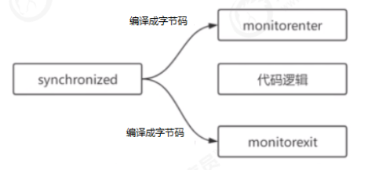
</center>

#### monitorenter

**首先我们来看一下JVM规范中对于monitorenter的描述：**

https://docs.oracle.com/javase/specs/jvms/se8/html/jvms-6.html#jvms-6.5.monitorenter

> Each object is associated with a monitor. A monitor is locked if and only if it has an owner.
> The thread that executes monitorenter attempts to gain ownership of the monitor
> associated with objectref, as follows: • If the entry count of the monitor associated with
> objectref is zero, the thread enters the monitor and sets its entry count to one. The thread
> is then the owner of the monitor. • If the thread already owns the monitor associated with
> objectref, it reenters the monitor, incrementing its entry count. • If another thread already owns the monitor associated with objectref, the thread blocks until the monitor's
> entry count is zero, then tries again to gain ownership.

翻译过来： 每一个对象都会和一个监视器monitor关联。监视器被占用时会被锁住,其他线程无法来获
取该monitor。 当JVM执行某个线程的某个方法内部的monitorenter时,它会尝试去获取当前对象对应
的monitor的所有权。其过程如下：
1. 若monior的进入数为0,线程可以进入monitor,并将monitor的进入数置为1。当前线程成为
   monitor的owner（所有者）
2. 若线程已拥有monitor的所有权,允许它重入monitor,则进入monitor的进入数加1
3. 若其他线程已经占有monitor的所有权,那么当前尝试获取monitor的所有权的线程会被阻塞,直
   到monitor的进入数变为0,才能重新尝试获取monitor的所有权。

monitorenter小结:

synchronized的锁对象会关联一个monitor,这个monitor不是我们主动创建的,是JVM的线程执行到这个
同步代码块,发现锁对象没有monitor就会创建monitor,monitor内部有两个重要的成员变量owner:拥有
这把锁的线程,recursions会记录线程拥有锁的次数,当一个线程拥有monitor后其他线程只能等待

#### monitorexit

**首先我们来看一下JVM规范中对于monitorexit的描述：**
https://docs.oracle.com/javase/specs/jvms/se8/html/jvms-6.html#jvms-6.5.monitorexit

> The thread that executes monitorexit must be the owner of the monitor associated with the
> instance referenced by objectref. The thread decrements the entry count of the monitor
> associated with objectref. If as a result the value of the entry count is zero, the thread
> exits the monitor and is no longer its owner. Other threads that are blocking to enter the
> monitor are allowed to attempt to do so.

翻译过来：
1. 能执行monitorexit指令的线程一定是拥有当前对象的monitor的所有权的线程。
2. 执行monitorexit时会将monitor的进入数减1。当monitor的进入数减为0时,当前线程退出
   monitor,不再拥有monitor的所有权,此时其他被这个monitor阻塞的线程可以尝试去获取这个
   monitor的所有权

monitorexit释放锁。

monitorexit插入在方法结束处和异常处,JVM保证每个monitorenter必须有对应的monitorexit。

>面试题synchroznied出现异常会释放锁吗?
>
> 会释放锁

#### 同步方法
https://docs.oracle.com/javase/specs/jvms/se8/html/jvms-2.html#jvms-2.11.10

可以看到同步方法在反汇编后,会增加ACC_SYNCHRONIZED 修饰。会隐式调用monitorenter和
monitorexit。在执行同步方法前会调用monitorenter,在执行完同步方法后会调用monitorexit。

#### 小结
通过javap反汇编我们看到synchronized使用编程了monitorentor和monitorexit两个指令.每个锁对象
都会关联一个monitor(监视器,它才是真正的锁对象),它内部有两个重要的成员变量owner会保存获得锁
的线程,recursions会保存线程获得锁的次数,当执行到monitorexit时,recursions会-1,当计数器减到0时
这个线程就会释放锁

#### 面试题：synchronized与Lock的区别
1. synchronized是关键字,而Lock是一个接口。
2. synchronized会自动释放锁,而Lock必须手动释放锁。
3. synchronized是不可中断的,Lock可以中断也可以不中断。
4. 通过Lock可以知道线程有没有拿到锁,而synchronized不能。
5. synchronized能锁住方法和代码块,而Lock只能锁住代码块。
6. Lock可以使用读锁提高多线程读效率。
7. synchronized是非公平锁,ReentrantLock可以控制是否是公平锁。


### 深入JVM源码
<hr>

#### 目标
通过JVM源码分析synchronized的原理

#### JVM源码下载
http://openjdk.java.net/    --> Mercurial --> jdk8 --> hotspot --> zip

#### IDE(Clion )下载
https://www.jetbrains.com/

#### monitor监视器锁
可以看出无论是synchronized代码块还是synchronized方法,其线程安全的语义实现最终依赖一个叫
monitor的东西,那么这个神秘的东西是什么呢？下面让我们来详细介绍一下。

在HotSpot虚拟机中,monitor是由ObjectMonitor实现的。其源码是用c++来实现的,位于HotSpot虚
拟机源码ObjectMonitor.hpp文件中(src/share/vm/runtime/objectMonitor.hpp)。ObjectMonitor主
要数据结构如下：

```c++
ObjectMonitor() {
    _header = NULL;
    _count = 0;
    _waiters = 0,
    _recursions = 0; // 线程的重入次数
    _object = NULL; // 存储该monitor的对象
    _owner = NULL; // 标识拥有该monitor的线程
    _WaitSet = NULL; // 处于wait状态的线程,会被加入到_WaitSet
    _WaitSetLock = 0 ;
    _Responsible = NULL;
    _succ = NULL;
    _cxq = NULL; // 多线程竞争锁时的单向列表
    FreeNext = NULL;
    _EntryList = NULL; // 处于等待锁block状态的线程,会被加入到该列表
    _SpinFreq = 0;
    _SpinClock = 0;
    OwnerIsThread = 0;
}
```

1. _owner：初始时为NULL。当有线程占有该monitor时,owner标记为该线程的唯一标识。当线程
   释放monitor时,owner又恢复为NULL。owner是一个临界资源,JVM是通过CAS操作来保证其线
   程安全的。
2. _cxq：竞争队列,所有请求锁的线程首先会被放在这个队列中（单向链接）。_cxq是一个临界资
   源,JVM通过CAS原子指令来修改_cxq队列。修改前_cxq的旧值填入了node的next字段,_cxq指
   向新值（新线程）。因此_cxq是一个后进先出的stack（栈）。
3. _EntryList：_cxq队列中有资格成为候选资源的线程会被移动到该队列中。
4. _WaitSet：因为调用wait方法而被阻塞的线程会被放在该队列中。

每一个Java对象都可以与一个监视器monitor关联,我们可以把它理解成为一把锁,当一个线程想要执
行一段被synchronized圈起来的同步方法或者代码块时,该线程得先获取到synchronized修饰的对象
对应的monitor。

我们的Java代码里不会显示地去创造这么一个monitor对象,我们也无需创建,事实上可以这么理解：
monitor并不是随着对象创建而创建的。我们是通过synchronized修饰符告诉JVM需要为我们的某个对
象创建关联的monitor对象。每个线程都存在两个ObjectMonitor对象列表,分别为free和used列表。
同时JVM中也维护着global locklist。当线程需要ObjectMonitor对象时,首先从线程自身的free表中申
请,若存在则使用,若不存在则从global list中申请。

ObjectMonitor的数据结构中包含：_owner、_WaitSet和_EntryList,它们之间的关系转换可以用下图
表示：

<center>

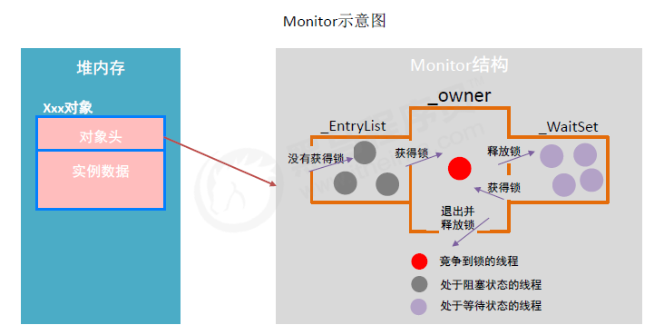
</center>


#### monitor竞争
1. 执行monitorenter时,会调用InterpreterRuntime.cpp 
  
    (位于：src/share/vm/interpreter/interpreterRuntime.cpp) 的 InterpreterRuntime::monitorenter函
   数。具体代码可参见HotSpot源码。
```c++
IRT_ENTRY_NO_ASYNC(void, InterpreterRuntime::monitorenter(JavaThread* thread,
BasicObjectLock* elem))
#ifdef ASSERT
    thread->last_frame().interpreter_frame_verify_monitor(elem);
#endif
    if (PrintBiasedLockingStatistics) {
        Atomic::inc(BiasedLocking::slow_path_entry_count_addr());
    }
    Handle h_obj(thread, elem->obj());
    assert(Universe::heap()->is_in_reserved_or_null(h_obj()),
            "must be NULL or an object");
    if (UseBiasedLocking) {
        // Retry fast entry if bias is revoked to avoid unnecessary inflation
        ObjectSynchronizer::fast_enter(h_obj, elem->lock(), true, CHECK);
    } else {
        ObjectSynchronizer::slow_enter(h_obj, elem->lock(), CHECK);
    }
    assert(Universe::heap()->is_in_reserved_or_null(elem->obj()),
            "must be NULL or an object"); 
```

2. 对于重量级锁,monitorenter函数中会调用 ObjectSynchronizer::slow_enter
3. 最终调用 ObjectMonitor::enter（位于：src/share/vm/runtime/objectMonitor.cpp）,源码如下：
```c++
void ATTR ObjectMonitor::enter(TRAPS) {
    // The following code is ordered to check the most common cases first
    // and to reduce RTS->RTO cache line upgrades on SPARC and IA32 processors.
    Thread * const Self = THREAD ;
    void * cur ;
    
    // 通过CAS操作尝试把monitor的_owner字段设置为当前线程
    cur = Atomic::cmpxchg_ptr (Self, &_owner, NULL) ;
    if (cur == NULL) {
        // Either ASSERT _recursions == 0 or explicitly set _recursions = 0.
        assert (_recursions == 0 , "invariant") ;
        assert (_owner == Self, "invariant") ;
        // CONSIDER: set or assert OwnerIsThread == 1
        return ;
    }
    // 线程重入,recursions++
    if (cur == Self) {
        // TODO-FIXME: check for integer overflow! BUGID 6557169.
        _recursions ++ ;
        return ;
    }
    // 如果当前线程是第一次进入该monitor,设置_recursions为1,_owner为当前线程
    if (Self->is_lock_owned ((address)cur)) {
        assert (_recursions == 0, "internal state error");
        _recursions = 1 ;
        // Commute owner from a thread-specific on-stack BasicLockObject address to
        // a full-fledged "Thread *".
        _owner = Self ;
        OwnerIsThread = 1 ;
        return ;
    }
    // 省略一些代码
    for (;;) {
        jt->set_suspend_equivalent();
        // cleared by handle_special_suspend_equivalent_condition()
        // or java_suspend_self()
        // 如果获取锁失败,则等待锁的释放；
        EnterI (THREAD) ;
        if (!ExitSuspendEquivalent(jt)) break ;
        //
        // We have acquired the contended monitor, but while we were
        // waiting another thread suspended us. We don't want to enter
        // the monitor while suspended because that would surprise the
        // thread that suspended us.
        //
            _recursions = 0 ;
        _succ = NULL ;
        exit (false, Self) ;
        jt->java_suspend_self();
    }
    Self->set_current_pending_monitor(NULL);
}
```

此处省略锁的自旋优化等操作,统一放在后面synchronzied优化中说。

以上代码的具体流程概括如下：
1. 通过CAS尝试把monitor的owner字段设置为当前线程。
2. 如果设置之前的owner指向当前线程,说明当前线程再次进入monitor,即重入锁,执行
   recursions ++ ,记录重入的次数。
3. 如果当前线程是第一次进入该monitor,设置recursions为1,_owner为当前线程,该线程成功获
   得锁并返回。
4. 如果获取锁失败,则等待锁的释放。


#### monitor等待
竞争失败等待调用的是ObjectMonitor对象的EnterI方法（位于：src/share/vm/runtime/objectMonitor.cpp）,源码如下所示：

```c++
void ATTR ObjectMonitor::EnterI (TRAPS) {
    Thread * Self = THREAD ;
    // Try the lock - TATAS
    if (TryLock (Self) > 0) {
        assert (_succ != Self , "invariant") ;
        assert (_owner == Self , "invariant") ;
        assert (_Responsible != Self , "invariant") ;
        return ;
    }
    if (TrySpin (Self) > 0) {
        assert (_owner == Self , "invariant") ;
        assert (_succ != Self , "invariant") ;
        assert (_Responsible != Self , "invariant") ;
        return ;
    }
    // 省略部分代码
        
    // 当前线程被封装成ObjectWaiter对象node,状态设置成ObjectWaiter::TS_CXQ；
    ObjectWaiter node(Self) ;
    Self->_ParkEvent->reset() ;
    node._prev = (ObjectWaiter *) 0xBAD ;
    node.TState = ObjectWaiter::TS_CXQ ;
    
    // 通过CAS把node节点push到_cxq列表中
    ObjectWaiter * nxt ;
    for (;;) {
        node._next = nxt = _cxq ;
        if (Atomic::cmpxchg_ptr (&node, &_cxq, nxt) == nxt) break ;
        // Interference - the CAS failed because _cxq changed. Just retry.
        // As an optional optimization we retry the lock.
        if (TryLock (Self) > 0) {
            assert (_succ != Self , "invariant") ;
            assert (_owner == Self , "invariant") ;
            assert (_Responsible != Self , "invariant") ;
            return ;
        }
    }
    // 省略部分代码
    for (;;) {
        // 线程在被挂起前做一下挣扎,看能不能获取到锁
        if (TryLock (Self) > 0) break ;
            assert (_owner != Self, "invariant") ;
            if ((SyncFlags & 2) && _Responsible == NULL) {
            Atomic::cmpxchg_ptr (Self, &_Responsible, NULL) ;
        }
        // park self
        if (_Responsible == Self || (SyncFlags & 1)) {
            TEVENT (Inflated enter - park TIMED) ;
            Self->_ParkEvent->park ((jlong) RecheckInterval) ;
            // Increase the RecheckInterval, but clamp the value.
            RecheckInterval *= 8 ;
        if (RecheckInterval > 1000) RecheckInterval = 1000 ;
        } else {
            TEVENT (Inflated enter - park UNTIMED) ;
            // 通过park将当前线程挂起,等待被唤醒
            Self->_ParkEvent->park() ;
        }
        if (TryLock(Self) > 0) break ;
        // 省略部分代码
    }
    // 省略部分代码
}
```

当该线程被唤醒时,会从挂起的点继续执行,通过ObjectMonitor::TryLock 尝试获取锁,TryLock方
法实现如下：

```c++
int ObjectMonitor::TryLock (Thread * Self) {
    for (;;) {
        void * own = _owner ;
        if (own != NULL) return 0 ;
        if (Atomic::cmpxchg_ptr (Self, &_owner, NULL) == NULL) {
            // Either guarantee _recursions == 0 or set _recursions = 0.
            assert (_recursions == 0, "invariant") ;
            assert (_owner == Self, "invariant") ;
            // CONSIDER: set or assert that OwnerIsThread == 1
            return 1 ;
        }
        // The lock had been free momentarily, but we lost the race to the lock.
        // Interference -- the CAS failed.
        // We can either return -1 or retry.
        // Retry doesn't make as much sense because the lock was just acquired.
        if (true) return -1 ;
    }
}
```

以上代码的具体流程概括如下：
1. 当前线程被封装成ObjectWaiter对象node,状态设置成ObjectWaiter::TS_CXQ。
2. 在for循环中,通过CAS把node节点push到_cxq列表中,同一时刻可能有多个线程把自己的node
   节点push到_cxq列表中。
3. node节点push到_cxq列表之后,通过自旋尝试获取锁,如果还是没有获取到锁,则通过park将当
   前线程挂起,等待被唤醒。
4. 当该线程被唤醒时,会从挂起的点继续执行,通过ObjectMonitor::TryLock 尝试获取锁。

#### monitor释放
当某个持有锁的线程执行完同步代码块时,会进行锁的释放,给其它线程机会执行同步代码,在
HotSpot中,通过退出monitor的方式实现锁的释放,并通知被阻塞的线程,具体实现位于
ObjectMonitor的exit方法中。（位于：src/share/vm/runtime/objectMonitor.cpp）,源码如下所示：
```c++
void ATTR ObjectMonitor::exit(bool not_suspended, TRAPS) {
    Thread * Self = THREAD ;
    // 省略部分代码
    if (_recursions != 0) {
        _recursions--;   // this is simple recursive enter
        TEVENT (Inflated exit - recursive) ;
        return ;
    }

    // 省略部分代码
    ObjectWaiter * w = NULL ;
    int QMode = Knob_QMode ;
    // qmode = 2：直接绕过EntryList队列,从cxq队列中获取线程用于竞争锁
    if (QMode == 2 && _cxq != NULL) {
        w = _cxq ;
        assert (w != NULL, "invariant") ;
        assert (w->TState == ObjectWaiter::TS_CXQ, "Invariant") ;
        ExitEpilog (Self, w) ;
        return ;
    }
    // qmode =3：cxq队列插入EntryList尾部；
    if (QMode == 3 && _cxq != NULL) {
        w = _cxq ;
        for (;;) {
            assert (w != NULL, "Invariant") ;
            ObjectWaiter * u = (ObjectWaiter *) Atomic::cmpxchg_ptr (NULL,&_cxq, w) ;
                if (u == w) break ;
                w = u ;
        }
        assert (w != NULL , "invariant") ;
        ObjectWaiter * q = NULL ;
        ObjectWaiter * p ;
        for (p = w ; p != NULL ; p = p->_next) {
            guarantee (p->TState == ObjectWaiter::TS_CXQ, "Invariant") ;
            p->TState = ObjectWaiter::TS_ENTER ;
            p->_prev = q ;
            q = p ;
        }
        ObjectWaiter * Tail ;
        for (Tail = _EntryList ; Tail != NULL && Tail->_next != NULL ; Tail = Tail->_next) ;
        if (Tail == NULL) {
            _EntryList = w ;
        } else {
            Tail->_next = w ;
            w->_prev = Tail ;
        }
    }
    // qmode =4：cxq队列插入到_EntryList头部
    if (QMode == 4 && _cxq != NULL) {
        w = _cxq ;
        for (;;){
            assert(w!=NULL, "Invariant");
            ObjectWaiter*u=(ObjectWaiter*)Atomic::cmpxchg_ptr(NULL,
            &_cxq, w);
            if(u==w)break;
            w=u;
        }

        assert (w != NULL , "invariant") ;
        ObjectWaiter * q = NULL ;
        ObjectWaiter * p ;
        for (p = w ; p != NULL ; p = p->_next) {
            guarantee (p->TState == ObjectWaiter::TS_CXQ, "Invariant") ;
            p->TState = ObjectWaiter::TS_ENTER ;
            p->_prev = q ;
            q = p ;
        }

        if (_EntryList != NULL) {
            q->_next = _EntryList ;
            _EntryList->_prev = q ;
        }
        _EntryList = w ;
    }

    w = _EntryList ;
    if (w != NULL) {
        assert (w->TState == ObjectWaiter::TS_ENTER, "invariant") ;
        ExitEpilog (Self, w) ;
        return ;
    }
    w = _cxq ;
    if (w == NULL) continue ;
    for (;;) {
        assert (w != NULL, "Invariant") ;
        ObjectWaiter * u = (ObjectWaiter *) Atomic::cmpxchg_ptr (NULL, &_cxq,w) ;
        if (u == w) break ;
        w = u ;
    }
    TEVENT (Inflated exit - drain cxq into EntryList) ;
    assert (w != NULL , "invariant") ;
    assert (_EntryList == NULL , "invariant") ;
    if (QMode == 1) {
        // QMode == 1 : drain cxq to EntryList, reversing order
        // We also reverse the order of the list.
        ObjectWaiter * s = NULL ;
        ObjectWaiter * t = w ;
        ObjectWaiter * u = NULL ;
        while (t != NULL) {
            guarantee (t->TState == ObjectWaiter::TS_CXQ, "invariant") ;
            t->TState = ObjectWaiter::TS_ENTER ;
            u = t->_next ;
            t->_prev = u ;
            t->_next = s ;
            s = t;
            t = u ;
        }
        _EntryList = s ;
        assert (s != NULL, "invariant");
    } else {
        // QMode == 0 or QMode == 2
        _EntryList = w ;
        ObjectWaiter * q = NULL ;
        ObjectWaiter * p ;
        for (p = w ; p != NULL ; p = p->_next) {
            guarantee (p->TState == ObjectWaiter::TS_CXQ, "Invariant") ;
            p->TState = ObjectWaiter::TS_ENTER ;
            p->_prev = q ;
            q = p ;
        }
    }
    if (_succ != NULL) continue;
    w = _EntryList ;
    if (w != NULL) {
        guarantee (w->TState == ObjectWaiter::TS_ENTER, "invariant") ;
        ExitEpilog (Self, w) ;
        return ;
    }
}
```
1. 退出同步代码块时会让_recursions减1，当_recursions的值减为0时，说明线程释放了锁。
2. 根据不同的策略（由QMode指定），从cxq或EntryList中获取头节点，通过
   ObjectMonitor::ExitEpilog 方法唤醒该节点封装的线程，唤醒操作最终由unpark完成，实现
   如下：
```c++
void ObjectMonitor::ExitEpilog (Thread * Self， ObjectWaiter * Wakee) {
    assert (_owner == Self， "invariant") ;
    _succ = Knob_SuccEnabled ? Wakee->_thread : NULL ;
    ParkEvent * Trigger = Wakee->_event ;
    Wakee = NULL ;
    // Drop the lock
    OrderAccess::release_store_ptr (&_owner， NULL) ;
    OrderAccess::fence() ; // ST _owner vs LD in
    unpark()
    if (SafepointSynchronize::do_call_back()) {
        TEVENT (unpark before SAFEPOINT) ;
    }
    DTRACE_MONITOR_PROBE(contended__exit， this， object()， Self);
    Trigger->unpark() ; // 唤醒之前被pack()挂起的线程.
    // Maintain stats and report events to JVMTI
    if (ObjectMonitor::_sync_Parks != NULL) {
        ObjectMonitor::_sync_Parks->inc() ;
    }
}
```

被唤醒的线程，会回到void ATTR ObjectMonitor::EnterI (TRAPS) 的第600行，继续执行monitor
的竞争

```c++
// park self
if (_Responsible == Self || (SyncFlags & 1)) {
        TEVENT (Inflated enter - park TIMED) ;
        Self->_ParkEvent->park ((jlong) RecheckInterval) ;
        // Increase the RecheckInterval， but clamp the value.
        RecheckInterval *= 8 ;
        if (RecheckInterval > 1000) RecheckInterval = 1000 ;
    } else {
        TEVENT (Inflated enter - park UNTIMED) ;
        Self->_ParkEvent->park() ;
    }

if (TryLock(Self) > 0) break ;
```

#### monitor是重量级锁
可以看到ObjectMonitor的函数调用中会涉及到Atomic::cmpxchg_ptr，Atomic::inc_ptr等内核函数，
执行同步代码块，没有竞争到锁的对象会park()被挂起，竞争到锁的线程会unpark()唤醒。这个时候就
会存在操作系统用户态和内核态的转换，这种切换会消耗大量的系统资源。所以synchronized是Java语
言中是一个重量级(Heavyweight)的操作。

用户态和和内核态是什么东西呢？要想了解用户态和内核态还需要先了解一下Linux系统的体系架构：
<center>


</center>

从上图可以看出，Linux操作系统的体系架构分为：用户空间（应用程序的活动空间）和内核。

内核：本质上可以理解为一种软件，控制计算机的硬件资源，并提供上层应用程序运行的环境。

用户空间：上层应用程序活动的空间。应用程序的执行必须依托于内核提供的资源，包括CPU资源、存
储资源、I/O资源等。

系统调用：为了使上层应用能够访问到这些资源，内核必须为上层应用提供访问的接口：即系统调用。

所有进程初始都运行于用户空间，此时即为用户运行状态（简称：用户态）；但是当它调用系统调用执
行某些操作时，例如 I/O调用，此时需要陷入内核中运行，我们就称进程处于内核运行态（或简称为内
核态）。 系统调用的过程可以简单理解为：

1. 用户态程序将一些数据值放在寄存器中， 或者使用参数创建一个堆栈， 以此表明需要操作系统提
   供的服务。
2. 用户态程序执行系统调用。
3. CPU切换到内核态，并跳到位于内存指定位置的指令。
4. 系统调用处理器(system call handler)会读取程序放入内存的数据参数，并执行程序请求的服务。
5. 系统调用完成后，操作系统会重置CPU为用户态并返回系统调用的结果。

由此可见用户态切换至内核态需要传递许多变量，同时内核还需要保护好用户态在切换时的一些寄存器
值、变量等，以备内核态切换回用户态。这种切换就带来了大量的系统资源消耗，这就是在
synchronized未优化之前，效率低的原因。


## 第六章：JDK6 synchronized优化
<hr>

### CAS
<hr>

#### 目标
学习CAS的作用

学习CAS的原理

#### CAS概述和作用

CAS的全成是： Compare And Swap(比较相同再交换)。是现代CPU广泛支持的一种对内存中的共享数
据进行操作的一种特殊指令。

CAS的作用：CAS可以将比较和交换转换为原子操作，这个原子操作直接由CPU保证。CAS可以保证共
享变量赋值时的原子操作。CAS操作依赖3个值：内存中的值V，旧的预估值X，要修改的新值B，如果旧
的预估值X等于内存中的值V，就将新的值B保存到内存中。

#### CAS和volatile实现无锁并发
```java
package com.huajframe.demo05_cas;

import java.util.ArrayList;
import java.util.List;
import java.util.concurrent.atomic.AtomicInteger;

public class Demo01 {

   public static void main(String[] args) throws InterruptedException {
      AtomicInteger atomicInteger = new AtomicInteger();
      Runnable run = () -> {
         for (int i = 0; i < 1000; i++) {
            atomicInteger.incrementAndGet();
         }
      };

      List<Thread> list = new ArrayList<>();
      for(int i = 0; i < 5; i++){
         Thread thread = new Thread(run);
         thread.start();
         list.add(thread);
      }

      for(Thread t : list){
         t.join();
      }
      System.out.println("number = " + atomicInteger.get());
   }
}
```

#### CAS原理
通过刚才AtomicInteger的源码我们可以看到，Unsafe类提供了原子操作。

#### Unsafe类介绍
Unsafe类使Java拥有了像C语言的指针一样操作内存空间的能力，同时也带来了指针的问题。过度的使
用Unsafe类会使得出错的几率变大，因此Java官方并不建议使用的，官方文档也几乎没有。Unsafe对
象不能直接调用，只能通过反射获得
<center>


</center>

#### Unsafe实现CAS
<center>

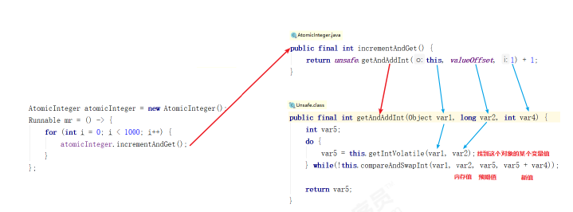
</center>

#### 乐观锁和悲观锁
悲观锁从悲观的角度出发：

总是假设最坏的情况，每次去拿数据的时候都认为别人会修改，所以每次在拿数据的时候都会上锁，这
样别人想拿这个数据就会阻塞。因此synchronized我们也将其称之为悲观锁。JDK中的ReentrantLock
也是一种悲观锁。性能较差！

乐观锁从乐观的角度出发:

总是假设最好的情况，每次去拿数据的时候都认为别人不会修改，就算改了也没关系，再重试即可。所
以不会上锁，但是在更新的时候会判断一下在此期间别人有没有去修改这个数据，如何没有人修改则更
新，如果有人修改则重试。

CAS这种机制我们也可以将其称之为乐观锁。综合性能较好！

> CAS获取共享变量时，为了保证该变量的可见性，需要使用volatile修饰。结合CAS和volatile可以
> 实现无锁并发，适用于竞争不激烈、多核 CPU 的场景下。
> 1. 因为没有使用 synchronized，所以线程不会陷入阻塞，这是效率提升的因素之一。
> 2. 但如果竞争激烈，可以想到重试必然频繁发生，反而效率会受影响。

#### 小结
CAS的作用? Compare And Swap，CAS可以将比较和交换转换为原子操作，这个原子操作直接由处理
器保证。

CAS的原理？CAS需要3个值:内存地址V，旧的预期值A，要修改的新值B，如果内存地址V和旧的预期值
A相等就修改内存地址值为B

### synchronized锁升级过程
<hr>

高效并发是从JDK 5到JDK 6的一个重要改进，HotSpot虛拟机开发团队在这个版本上花费了大量的精力
去实现各种锁优化技术，包括偏向锁( Biased Locking )、轻量级锁( Lightweight Locking )和如适应性
自旋(Adaptive Spinning)、锁消除( Lock Elimination)、锁粗化( Lock Coarsening )等，这些技术都是为
了在线程之间更高效地共享数据，以及解决竞争问题，从而提高程序的执行效率。

无锁--》偏向锁--》轻量级锁–》重量级锁

### Java对象的布局
<hr>

####  目标
学习Java对象的布局

术语参考: http://openjdk.java.net/groups/hotspot/docs/HotSpotGlossary.html

在JVM中，对象在内存中的布局分为三块区域：对象头、实例数据和对齐填充。如下图所示：
<center>


</center>

#### 对象头
当一个线程尝试访问synchronized修饰的代码块时，它首先要获得锁，那么这个锁到底存在哪里呢？是
存在锁对象的对象头中的。

HotSpot采用instanceOopDesc和arrayOopDesc来描述对象头，arrayOopDesc对象用来描述数组类
型。instanceOopDesc的定义的在Hotspot源码的 instanceOop.hpp 文件中，另外，arrayOopDesc
的定义对应 arrayOop.hpp 。
```c++
class instanceOopDesc : public oopDesc {
public:
   // aligned header size.
   static int header_size() { return sizeof(instanceOopDesc)/HeapWordSize; }
   // If compressed, the offset of the fields of the instance may not be aligned.
   static int base_offset_in_bytes() {
   // offset computation code breaks if UseCompressedClassPointers
   // only is true
   return (UseCompressedOops && UseCompressedClassPointers) ?
            klass_gap_offset_in_bytes() :
            sizeof(instanceOopDesc);
    }
    static bool contains_field_offset(int offset, int nonstatic_field_size) {
         int base_in_bytes = base_offset_in_bytes();
         return (offset >= base_in_bytes &&
                (offset-base_in_bytes) < nonstatic_field_size * heapOopSize);
    }
};
```

从instanceOopDesc代码中可以看到 instanceOopDesc继承自oopDesc，oopDesc的定义载Hotspot
源码中的 oop.hpp 文件中。

```c++
class oopDesc {
   friend class VMStructs;
   private:
      volatile markOop _mark;
      union _metadata {
         Klass* _klass;
         narrowKlass _compressed_klass;
      } _metadata;
      // Fast access to barrier set. Must be initialized.
      static BarrierSet* _bs;
      // 省略其他代码
};
```

<center>


</center>

在普通实例对象中，oopDesc的定义包含两个成员，分别是 _mark 和 _metadata

_mark 表示对象标记、属于markOop类型，也就是接下来要讲解的Mark World，它记录了对象和锁有
关的信息

_metadata 表示类元信息，类元信息存储的是对象指向它的类元数据(Klass)的首地址，其中Klass表示
普通指针、 _compressed_klass 表示压缩类指针。

对象头由两部分组成，一部分用于存储自身的运行时数据，称之为 Mark Word，另外一部分是类型指
针，及对象指向它的类元数据的指针。

#### Mark Word
Mark Word用于存储对象自身的运行时数据，如哈希码（HashCode）、GC分代年龄、锁状态标志、
线程持有的锁、偏向线程ID、偏向时间戳等等，占用内存大小与虚拟机位长一致。Mark Word对应的类
型是markOop 。源码位于markOop.hpp 中。
```c++
// Bit-format of an object header (most significant first, big endian layout below):
//
// 32 bits:
// --------
// hash:25 ------------>| age:4 biased_lock:1 lock:2 (normal object)
// JavaThread*:23 epoch:2 age:4 biased_lock:1 lock:2 (biased object)
// size:32 ------------------------------------------>| (CMS free block)
// PromotedObject*:29 ---------->| promo_bits:3 ----->| (CMS promoted object)
//
// 64 bits:
// --------
// unused:25 hash:31 -->| unused:1 age:4 biased_lock:1 lock:2 (normal object)
// JavaThread*:54 epoch:2 unused:1 age:4 biased_lock:1 lock:2 (biased object)
// PromotedObject*:61 --------------------->| promo_bits:3 ----->| (CMS promoted object)
// size:64 ----------------------------------------------------->| (CMS free block)
// [JavaThread* | epoch | age | 1 | 01] lock is biased toward given thread
// [0 | epoch | age | 1 | 01] lock is anonymously biased
//
// - the two lock bits are used to describe three states: locked/unlocked and monitor.
//
// [ptr | 00] locked ptr points to real header on stack
// [header | 0 | 01] unlocked regular object header
// [ptr | 10] monitor inflated lock (header is wapped out)
// [ptr | 11] marked used by markSweep to mark an object
// not valid at any other time
```

<center>


</center>

在64位虚拟机下，Mark Word是64bit大小的，其存储结构如下：
<center>


</center>

在32位虚拟机下，Mark Word是32bit大小的，其存储结构如下：
<center>

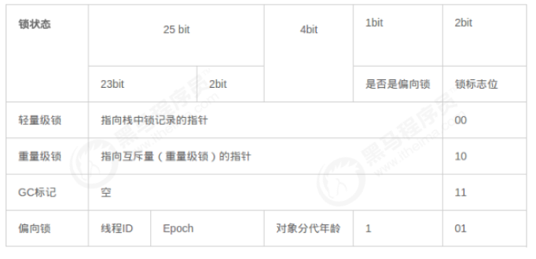
</center>

#### klass pointer
这一部分用于存储对象的类型指针，该指针指向它的类元数据，JVM通过这个指针确定对象是哪个类的
实例。该指针的位长度为JVM的一个字大小，即32位的JVM为32位，64位的JVM为64位。 如果应用的对
象过多，使用64位的指针将浪费大量内存，统计而言，64位的JVM将会比32位的JVM多耗费50%的内
存。为了节约内存可以使用选项-XX:+UseCompressedOops 开启指针压缩，其中，oop即ordinary
object pointer普通对象指针。开启该选项后，下列指针将压缩至32位：

1. 每个Class的属性指针（即静态变量）
2. 每个对象的属性指针（即对象变量）
3. 普通对象数组的每个元素指针

当然，也不是所有的指针都会压缩，一些特殊类型的指针JVM不会优化，比如指向PermGen的Class对
象指针(JDK8中指向元空间的Class对象指针)、本地变量、堆栈元素、入参、返回值和NULL指针等。

对象头 = Mark Word + 类型指针（未开启指针压缩的情况下）

在32位系统中，Mark Word = 4 bytes，类型指针 = 4bytes，对象头 = 8 bytes = 64 bits；

在64位系统中，Mark Word = 8 bytes，类型指针 = 8bytes，对象头 = 16 bytes = 128bits；

#### 实例数据
就是类中定义的成员变量。

#### 对齐填充
对齐填充并不是必然存在的，也没有什么特别的意义，他仅仅起着占位符的作用，由于HotSpot VM的
自动内存管理系统要求对象起始地址必须是8字节的整数倍，换句话说，就是对象的大小必须是8字节的
整数倍。而对象头正好是8字节的倍数，因此，当对象实例数据部分没有对齐时，就需要通过对齐填充
来补全。

#### 查看Java对象布局
```xml
<dependency>
   <groupId>org.openjdk.jol</groupId>
   <artifactId>jol-core</artifactId>
   <version>0.9</version>
</dependency>
```

#### 小结
Java对象由3部分组成，对象头，实例数据，对齐数据

对象头分成两部分：Mark World + Klass pointer

### 偏向锁
<hr>

#### 目标
学习偏向锁的原理和好处

#### 什么是偏向锁
偏向锁是JDK 6中的重要引进，因为HotSpot作者经过研究实践发现，在大多数情况下，锁不仅不存在多
线程竞争，而且总是由同一线程多次获得，为了让线程获得锁的代价更低，引进了偏向锁。

偏向锁的“偏”，就是偏心的“偏”、偏袒的“偏”，它的意思是这个锁会偏向于第一个获得它的线程，会在对
象头存储锁偏向的线程ID，以后该线程进入和退出同步块时只需要检查是否为偏向锁、锁标志位以及
ThreadID即可。
<center>


</center>

不过一旦出现多个线程竞争时必须撤销偏向锁，所以撤销偏向锁消耗的性能必须小于之前节省下来的
CAS原子操作的性能消耗，不然就得不偿失了。

#### 偏向锁原理

当线程第一次访问同步块并获取锁时，偏向锁处理流程如下：

> 1. 虚拟机将会把对象头中的标志位设为“01”，即偏向模式。
> 2. 同时使用CAS操作把获取到这个锁的线程的ID记录在对象的Mark Word之中 ，
     > 如果CAS操作 成功，持有偏向锁的线程以后每次进入这个锁相关的同步块时，
     > 虚拟机都可以不再进行任何 同步操作，偏向锁的效率高。
<center>


</center>

持有偏向锁的线程以后每次进入这个锁相关的同步块时，虚拟机都可以不再进行任何同步操作，偏向锁
的效率高。

#### 偏向锁的撤销
1. 偏向锁的撤销动作必须等待全局安全点
2. 暂停拥有偏向锁的线程，判断锁对象是否处于被锁定状态
3. 撤销偏向锁，恢复到无锁（标志位为 01）或轻量级锁（标志位为 00）的状态

偏向锁在Java 6之后是默认启用的，但在应用程序启动几秒钟之后才激活，可以使用-
XX:BiasedLockingStartupDelay=0 参数关闭延迟，如果确定应用程序中所有锁通常情况下处于竞争
状态，可以通过XX:-UseBiasedLocking=false 参数关闭偏向锁。

#### 偏向锁好处
偏向锁是在只有一个线程执行同步块时进一步提高性能，适用于一个线程反复获得同一锁的情况。偏向
锁可以提高带有同步但无竞争的程序性能。

它同样是一个带有效益权衡性质的优化，也就是说，它并不一定总是对程序运行有利，如果程序中大多
数的锁总是被多个不同的线程访问比如线程池，那偏向模式就是多余的。

在JDK5中偏向锁默认是关闭的，而到了JDK6中偏向锁已经默认开启。但在应用程序启动几秒钟之后才
激活，可以使用-XX:BiasedLockingStartupDelay=0 参数关闭延迟，如果确定应用程序中所有锁通常
情况下处于竞争状态，可以通过XX:-UseBiasedLocking=false 参数关闭偏向锁。

#### 小结
偏向锁的原理是什么?

```text
当锁对象第一次被线程获取的时候，虚拟机将会把对象头中的标志位设为“01”，即偏向模式。同时使用CAS操
作把获取到这个锁的线程的ID记录在对象的Mark Word之中 ，如果CAS操作成功，持有偏向锁的线程以后每
次进入这个锁相关的同步块时，虚拟机都可以不再进行任何同步操作，偏向锁的效率高。
```
偏向锁的好处是什么?
```text
偏向锁是在只有一个线程执行同步块时进一步提高性能，适用于一个线程反复获得同一锁的情况。偏向锁可以
提高带有同步但无竞争的程序性能。
```

### 轻量级锁
<hr>

#### 目标
学习轻量级锁的原理和好处

#### 什么是轻量级锁
轻量级锁是JDK 6之中加入的新型锁机制，它名字中的“轻量级”是相对于使用monitor的传统锁而言的，
因此传统的锁机制就称为“重量级”锁。首先需要强调一点的是，轻量级锁并不是用来代替重量级锁的。

引入轻量级锁的目的：在多线程交替执行同步块的情况下，尽量避免重量级锁引起的性能消耗，但是如
果多个线程在同一时刻进入临界区，会导致轻量级锁膨胀升级重量级锁，所以轻量级锁的出现并非是要
替代重量级锁。

#### 轻量级锁原理
当关闭偏向锁功能或者多个线程竞争偏向锁导致偏向锁升级为轻量级锁，则会尝试获取轻量级锁，其步
骤如下： 获取锁

1. 判断当前对象是否处于无锁状态（hashcode、0、01），如果是，则JVM首先将在当前线程的栈帧
   中建立一个名为锁记录（Lock Record）的空间，用于存储锁对象目前的Mark Word的拷贝（官方
   把这份拷贝加了一个Displaced前缀，即Displaced Mark Word），将对象的Mark Word复制到栈
   帧中的Lock Record中，将Lock Reocrd中的owner指向当前对象。
2. JVM利用CAS操作尝试将对象的Mark Word更新为指向Lock Record的指针，如果成功表示竞争到
   锁，则将锁标志位变成00，执行同步操作。
3. 如果失败则判断当前对象的Mark Word是否指向当前线程的栈帧，如果是则表示当前线程已经持
   有当前对象的锁，则直接执行同步代码块；否则只能说明该锁对象已经被其他线程抢占了，这时轻
   量级锁需要膨胀为重量级锁，锁标志位变成10，后面等待的线程将会进入阻塞状态。

<center>

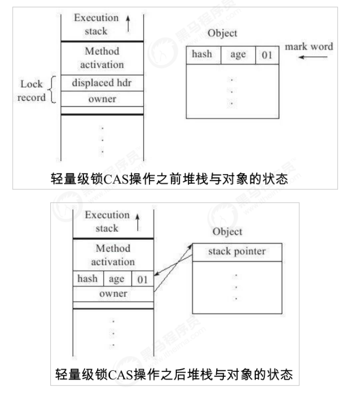
</center>

#### 轻量级锁的释放
轻量级锁的释放也是通过CAS操作来进行的，主要步骤如下：
1. 取出在获取轻量级锁保存在Displaced Mark Word中的数据。
2. 用CAS操作将取出的数据替换当前对象的Mark Word中，如果成功，则说明释放锁成功。
3. 如果CAS操作替换失败，说明有其他线程尝试获取该锁，则需要将轻量级锁需要膨胀升级为重量级
   锁。

对于轻量级锁，其性能提升的依据是“对于绝大部分的锁，在整个生命周期内都是不会存在竞争的”，如
果打破这个依据则除了互斥的开销外，还有额外的CAS操作，因此在有多线程竞争的情况下，轻量级锁
比重量级锁更慢。

#### 轻量级锁好处
在多线程交替执行同步块的情况下，可以避免重量级锁引起的性能消耗。

#### 小结
轻量级锁的原理是什么？

将对象的Mark Word复制到栈帧中的Lock Recod中。Mark Word更新为指向Lock Record的指针。

轻量级锁好处是什么？
```text
在多线程交替执行同步块的情况下，可以避免重量级锁引起的性能消耗。
```

### 自旋锁
<hr>

#### 目标
学习自旋锁原理

#### 自旋锁原理
```java
synchronized (Demo01.class) {
    ...
    System.out.println("aaa");
}
```

前面我们讨论monitor实现锁的时候，知道monitor会阻塞和唤醒线程，线程的阻塞和唤醒需要CPU从
用户态转为核心态，频繁的阻塞和唤醒对CPU来说是一件负担很重的工作，这些操作给系统的并发性能
带来了很大的压力。同时，虚拟机的开发团队也注意到在许多应用上，共享数据的锁定状态只会持续很
短的一段时间，为了这段时间阻塞和唤醒线程并不值得。如果物理机器有一个以上的处理器，能让两个
或以上的线程同时并行执行，我们就可以让后面请求锁的那个线程“稍等一下”，但不放弃处理器的执行
时间，看看持有锁的线程是否很快就会释放锁。为了让线程等待，我们只需让线程执行一个忙循环(自
旋) , 这项技术就是所谓的自旋锁。

自旋锁在JDK 1.4.2中就已经引入 ，只不过默认是关闭的，可以使用-XX:+UseSpinning参数来开启，在
JDK 6中 就已经改为默认开启了。自旋等待不能代替阻塞，且先不说对处理器数量的要求，自旋等待本
身虽然避免了线程切换的开销，但它是要占用处理器时间的，因此，如果锁被占用的时间很短，自旋等
待的效果就会非常好，反之，如果锁被占用的时间很长。那么自旋的线程只会白白消耗处理器资源，而
不会做任何有用的工作，反而会带来性 能上的浪费。因此，自旋等待的时间必须要有一定的限度，如果
自旋超过了限定的次数仍然没有成功获得锁，就应当使用传统的方式去挂起线程了。自旋次数的默认值
是10次，用户可以使用参数-XX : PreBlockSpin来更改。

#### 适应性自旋锁
在JDK 6中引入了自适应的自旋锁。自适应意味着自旋的时间不再固定了，而是由前一次在同一个锁上
的自旋时间及锁的拥有者的状态来决定。如果在同一个锁对象上，自旋等待刚刚成功获得过锁，并且持
有锁的线程正在运行中，那么虚拟机就会认为这次自旋也很有可能再次成功，进而它将允许自旋等待持
续相对更长的时间，比如100次循环。另外，如果对于某个锁，自旋很少成功获得过，那在以后要获取
这个锁时将可能省略掉自旋过程，以避免浪费处理器资源。有了自适应自旋，随着程序运行和性能监控
信息的不断完善，虚拟机对程序锁的状况预测就会越来越准确，虛拟机就会变得越来越“聪明”了。

### 锁消除
<hr>

#### 目标
学习如何进行锁消除

锁消除是指虚拟机即时编译器（JIT）在运行时，对一些代码上要求同步，但是被检测到不可能存在共享
数据竞争的锁进行消除。锁消除的主要判定依据来源于逃逸分析的数据支持，如果判断在一段代码中，
堆上的所有数据都不会逃逸出去从而被其他线程访问到，那就可以把它们当做栈上数据对待，认为它们
是线程私有的，同步加锁自然就无须进行。变量是否逃逸，对于虚拟机来说需要使用数据流分析来确
定，但是程序员自己应该是很清楚的，怎么会在明知道不存在数据争用的情况下要求同步呢?实际上有
许多同步措施并不是程序员自己加入的，同步的代码在Java程序中的普遍程度也许超过了大部分读者的
想象。下面这段非常简单的代码仅仅是输出3个字符串相加的结果，无论是源码字面上还是程序语义上
都没有同步。

```java
public class Demo01 {
   public static void main(String[] args) {
        contactString("aa", "bb", "cc");
   }
   public static String contactString(String s1, String s2, String s3) {
        return new StringBuffer().append(s1).append(s2).append(s3).toString();
   }
}
```

StringBuffer的append ( ) 是一个同步方法，锁就是this也就是(new StringBuilder())。虚拟机发现它的
动态作用域被限制在concatString( )方法内部。也就是说, new StringBuilder()对象的引用永远不会“逃
逸”到concatString ( )方法之外，其他线程无法访问到它，因此，虽然这里有锁，但是可以被安全地消除
掉，在即时编译之后，这段代码就会忽略掉所有的同步而直接执行了。

### 锁粗化
<hr>

#### 目标
学习锁粗化的原理

原则上，我们在编写代码的时候，总是推荐将同步块的作用范围限制得尽量小，只在共享数据的实际作
用域中才进行同步，这样是为了使得需要同步的操作数量尽可能变小，如果存在锁竞争，那等待锁的线
程也能尽快拿到锁。大部分情况下，上面的原则都是正确的，但是如果一系列的连续操作都对同一个对
象反复加锁和解锁，甚至加锁操作是出现在循环体中的，那即使没有线程竞争，频繁地进行互斥同步操
作也会导致不必要的性能损耗。

```java
public class Demo01 {
   public static void main(String[] args) {
        StringBuffer sb = new StringBuffer();
        for (int i = 0; i < 100; i++) {
            sb.append("aa");
        }
        System.out.println(sb.toString());
   }
}
```

#### 小结
什么是锁粗化？JVM会探测到一连串细小的操作都使用同一个对象加锁，将同步代码块的范围放大，放
到这串操作的外面，这样只需要加一次锁即可。

### 平时写代码如何对synchronized优化
<hr>

#### 减少synchronized的范围
同步代码块中尽量短，减少同步代码块中代码的执行时间，减少锁的竞争
```java
synchronized (Demo01.class) {
    System.out.println("aaa");
}
```

#### 降低synchronized锁的粒度
将一个锁拆分为多个锁提高并发度
```java
Hashtable hs = new Hashtable();
hs.put("aa", "bb");
hs.put("xx", "yy");
```

<center>

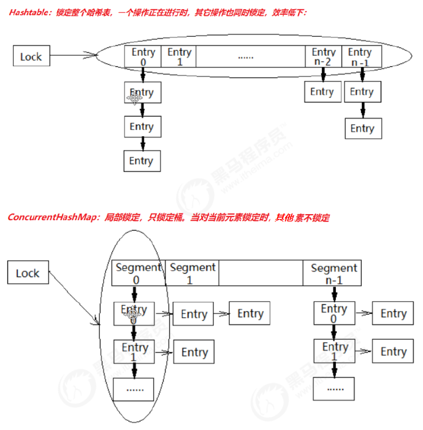
</center>

<center>


</center>

<center>


</center>

#### 读写分离
<font color="red">读取时不加锁，写入和删除时加锁</font> 

ConcurrentHashMap，CopyOnWriteArrayList和ConyOnWriteSet